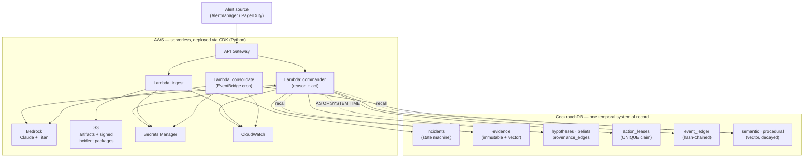

<div align="center">

# 🧠 Retrace

### The on-call agent that can prove what it knew, and when.

**Agentic memory as one transactional, temporal system of record — on CockroachDB, serverless on AWS.**

[](https://github.com/umarhashmi2002/retrace/actions/workflows/ci.yml)
[](./LICENSE)
[](https://www.python.org)
[](https://www.cockroachlabs.com)
[](https://aws.amazon.com)

*Built for the [CockroachDB × AWS "Agentic Memory" Hackathon](https://cockroachdb-ai.devpost.com/).*

</div>

---

> **At 03:14, Retrace believed a traffic surge was causing the outage. At 03:17, a deploy
> correlation flipped its conclusion to a connection leak.** Retrace can reconstruct *both*
> belief states exactly, explain which evidence changed its mind, and prove the rollback was
> justified — **without using anything it learned later.**
>
> **And when 25 duplicate workers race to execute that rollback, CockroachDB grants exactly one
> the action claim. If that worker crashes mid-rollback, another resumes from durable memory —
> and the rollback never runs twice.**

Those two paragraphs are things a chatbot-with-a-vector-store physically cannot do. They are the
product. Every mechanism below is exercised by the test suite and by `retrace demo`, live against
CockroachDB 25.2.

## Why an agent needs a *temporal* memory, not a vector cache

On-call engineers fight the same fires repeatedly, and post-incident reviews ask a brutal question:
*"what did we know, and when did we know it?"* A stateless LLM copilot can't answer that — it forgets
the moment the session ends, and a bolt-on vector store has no notion of *time* or *consistency*.

Retrace treats **memory itself as the product**. Operational state, evidence, embeddings, beliefs, and
decisions all live in **one** CockroachDB cluster, which unlocks five things no split
operational-DB-plus-vector-store architecture can offer without building its own event-sourcing and
version-synchronization layer:

| # | Mechanism | What makes it hard to copy | CockroachDB capability |
|---|-----------|----------------------------|------------------------|
| 1 | **Temporal belief reconstruction** | The 03:14 view must not leak evidence written at 03:17 | `AS OF SYSTEM TIME` at a captured HLC — **MVCC enforces no-leak**, not app filtering |
| 2 | **Belief-revision provenance** | *Which evidence changed the agent's mind, and when* | Bitemporal `beliefs` (`valid_from/until`, `superseded_by`) + a typed provenance graph |
| 3 | **Memory governs action** | Only one of N duplicate workers may act; crashes must not double-execute | `UNIQUE(org_id, action_key)` action lease + idempotency + expiry takeover |
| 4 | **Evidence-preserving consolidation** | Learn without corrupting the record | Immutable evidence; only semantic/procedural layers are revised & *retrieval-decayed* |
| 5 | **Permanent, tamper-evident provenance** | Audit that outlives the GC window | Append-only, **hash-chained** `event_ledger` + signed incident packages in S3 |

> **Positioning, stated precisely:** a split operational/vector architecture requires separate
> versioning and synchronization to reconstruct a consistent historical belief state. Retrace keeps
> operational state, evidence, vectors, and decisions in **one temporal system of record** — so a
> single, transactionally-consistent point-in-time view comes without maintaining two independently
> synchronized stores.

## See it in 60 seconds

```bash
make bootstrap      # uv-managed venv + dev deps
make db-up          # local CockroachDB (docker) + schema migration
uv run retrace demo # narrate every mechanism, live against the database
```

Abridged output:

```text
t1 · 03:14 — first evidence arrives
  belief · Traffic surge overwhelming the service   58%
  belief · Recent deploy introduced a connection    11%
  captured HLC               1785545243849333637.0000000000

t2 · 03:17 — deploy evidence changes everything
  belief · Recent deploy introduced a connection    87%
  belief · Traffic surge overwhelming the service    8%

MECHANISM 1 · Temporal reconstruction (AS OF SYSTEM TIME)
  → evidence visible at t1: 1   |   now: 2
  No-leak guarantee: deploy evidence hidden from the past view = True

MECHANISM 3 · Transactional action lease (safe autonomy)
  25 duplicate workers propose the same rollback...
  workers that won the claim  1  (worker-0)
  takeover while holder alive  refused

MECHANISM 4 · Hash-chained permanent provenance
  ledger chain verified       True
```

The demo runs fully offline (deterministic hash embeddings); add `--bedrock` to use Amazon Titan
embeddings. The same behavior is asserted in `tests/integration/` (`make test-integration`).

## The memory model

Four memory tiers, plus the belief/provenance layer that makes it *agentic* rather than a RAG cache —
all in CockroachDB:

| Tier | Table(s) | Mutability | CockroachDB feature |
|------|----------|------------|---------------------|
| **Episodic** | `evidence`, `event_ledger` | **immutable** (append-only) | `VECTOR` + C-SPANN recall; hash chain; HLC (`db_ts`) |
| **Belief** | `hypotheses`, `beliefs`, `provenance_edges` | append-only, time-versioned | bitemporal columns, partial index, `AS OF SYSTEM TIME` |
| **Semantic / Procedural** | `semantic_memory`, `procedural_memory` | revisable + retrieval-decayed | `VECTOR` + C-SPANN, `superseded_by` |
| **Working** | `working_memory` | disposable | **Row-Level TTL** (safe to physically delete) |
| **Action** | `action_leases` | transactional | `UNIQUE` claim + idempotency + expiry |

See [`db/migrations/0001_init.sql`](./db/migrations/0001_init.sql) for the fully-commented schema and
[`docs/MEMORY_MODEL.md`](./docs/MEMORY_MODEL.md) for the design rationale (including why we *don't*
blindly re-summarize memory).

## Architecture



See [`docs/ARCHITECTURE.md`](./docs/ARCHITECTURE.md) for the full design.

## Tools & services

**CockroachDB tools** (hackathon requires ≥ 2 — Retrace meaningfully uses **all four**):

| Tool | How Retrace uses it |
|------|---------------------|
| **Distributed Vector Indexing (C-SPANN)** | `evidence`, `semantic_memory`, `procedural_memory` use `VECTOR(1024)` columns with C-SPANN indexes (org-prefixed for tenant pre-filtering) for ANN recall. |
| **Managed MCP Server** | The agent introspects and reads memory through the read-only-by-default MCP endpoint — safe, audited, no custom proxy. |
| **ccloud CLI** | Cluster / database / service-account provisioning is scripted with `ccloud ... -o json` (see [`scripts/bootstrap_cockroach.sh`](./scripts/bootstrap_cockroach.sh)). |
| **Agent Skills Repo** | `cockroachlabs/cockroachdb-skills` is used in the dev loop for schema / performance / security review. |

**AWS services** (requires ≥ 1 — Retrace uses several): Amazon **Bedrock** (Claude reasoning + Titan
embeddings) · AWS **Lambda** (agent execution) · Amazon **S3** (artifacts) · **API Gateway** ·
**EventBridge** (consolidation schedule) · **Secrets Manager** · **CloudWatch** — all provisioned with
the **AWS CDK** in Python.

## How it maps to the judging criteria

| Criterion | How Retrace delivers |
|-----------|----------------------|
| **Agentic Memory Design** | Production-grade memory: immutable evidence at scale, time-versioned beliefs, transactional action state, and vectors — one system, no ETL, no consistency gaps. |
| **Technological Implementation** | C-SPANN vector indexes, `AS OF SYSTEM TIME`, serializable action leases, Row-Level TTL, hash chains — used correctly and safely. Typed (`mypy --strict`), tested (unit + live-DB integration), CI-gated. |
| **Real-World Impact** | On-call is universal and expensive. Retrace compounds institutional knowledge and makes autonomous remediation *safe* enough to trust. |
| **Product Readiness** | Least-privilege IAM, secrets in Secrets Manager, single-owner action leases + idempotency + crash takeover, tamper-evident audit, structured logs, CloudWatch. See [`docs/SECURITY.md`](./docs/SECURITY.md). |
| **Creativity & Originality** | Temporal belief reconstruction + evidence-linked belief revision + crash-safe action coordination — a genuinely novel use of a distributed temporal database as agent memory. |

## Repository layout

```text
retrace/
├── src/retrace/
│   ├── memory/     # ⭐ engine: evidence · beliefs · temporal · leases · ledger · incidents
│   ├── agent/      # SRE Incident Commander (Bedrock Claude + tools)  [in progress]
│   ├── api/        # AWS Lambda handlers (ingest · commander · consolidate)  [in progress]
│   ├── db/         # CockroachDB connection + idempotent migration runner
│   └── cli.py      # `retrace demo`, `retrace migrate`
├── db/migrations/  # fully-commented SQL schema (vectors, TTL, hash chain, leases)
├── infra/          # AWS CDK app (Python)  [in progress]
├── scripts/        # ccloud bootstrap · seed data
├── tests/          # unit (no DB) + integration (live CockroachDB)
└── docs/           # architecture · memory model · security · deployment
```

## Status

🚧 Active build for the hackathon (deadline **Aug 18, 2026**). **Done & validated:** the memory
engine and all five mechanisms (13 tests green against CockroachDB 25.2). **In progress:** the
Bedrock agent loop, Lambda handlers, and CDK deployment. Track it in [`docs/ROADMAP.md`](./docs/ROADMAP.md).

## License

[Apache License 2.0](./LICENSE) — © 2026 Umar Hashmi. Built during the hackathon submission period;
see [`docs/SUBMISSION.md`](./docs/SUBMISSION.md) for the full disclosure of tools and services.
