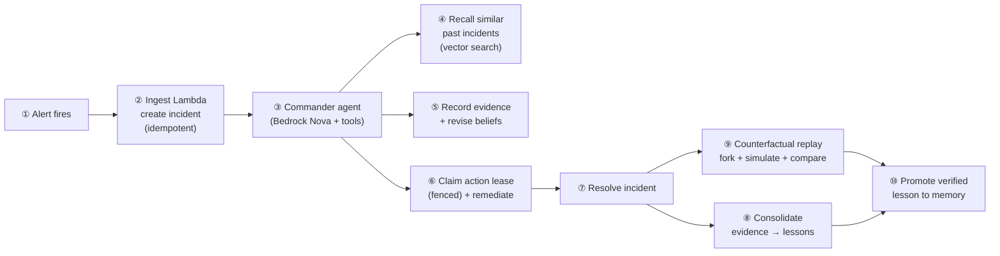
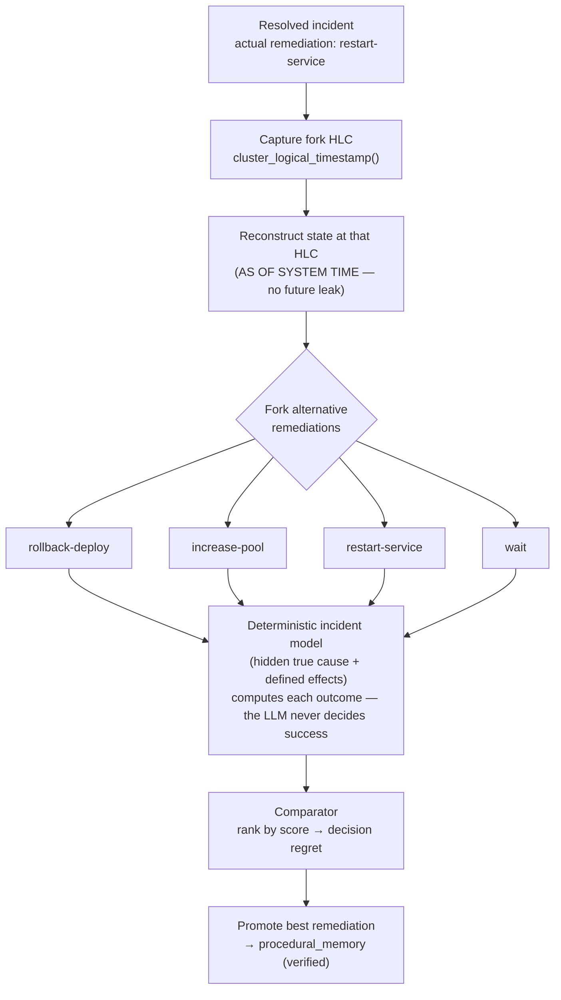
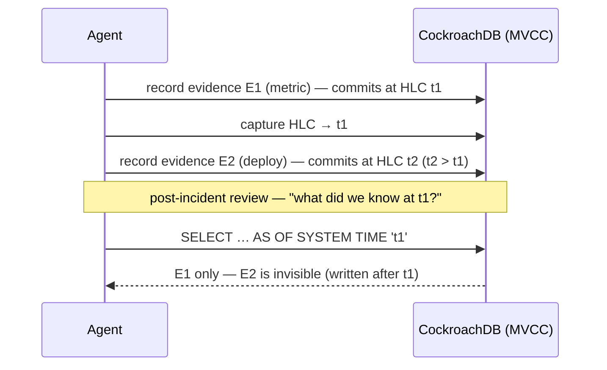
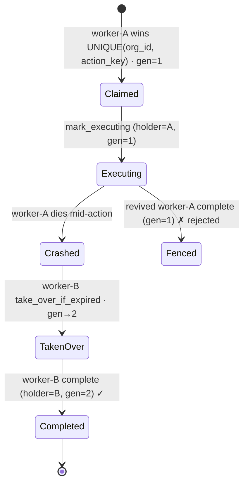
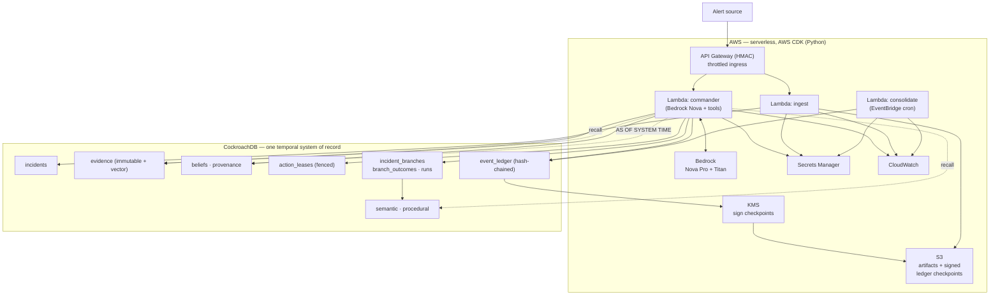

<div align="center">

# 🔁 Backcast

### Rewind an incident. Fork the decision. Compare what would have happened.

**A temporal decision laboratory for on-call — agentic memory on CockroachDB, serverless on AWS.**

[](https://github.com/umarhashmi2002/backcast/actions/workflows/ci.yml)
[](./LICENSE)
[](https://www.python.org)
[](https://www.cockroachlabs.com)
[](https://aws.amazon.com)

*Built for the [CockroachDB × AWS "Agentic Memory" Hackathon](https://cockroachdb-ai.devpost.com/).*

</div>

---

> **An on-call engineer restarts a service and the alert clears. Incident resolved — or was it?**
>
> Backcast rewinds to the moment of decision, **forks the incident**, and replays the alternatives
> against a *deterministic* incident model. The restart only *relieved* the symptom (it would recur).
> A deploy rollback was the permanent fix. Backcast quantifies the gap — **decision regret** — and
> writes the verified lesson back into the agent's memory:

```text
REWIND → FORK → COMPARE   (outcomes computed deterministically, not by an LLM)

  branch                 score  result   t(s)  risk   note
  fork:rollback-deploy    0.88  fixed     120   0.2   ★ BEST
  fork:increase-pool     0.818  fixed     210   0.3
  actual (restart)       -0.36  recurs     60   0.1   ← what we actually did
  fork:wait               -0.10 no fix       0   0.0

  decision regret (best − actual) = 1.24
  lesson promoted → "For a deploy that shrank the DB pool, the verified best remediation is
                     rollback-deploy (permanent fix)."
```

That loop — *reconstruct the past, fork it, simulate alternatives, and learn which decision was
best* — is only tractable because operational state, evidence, beliefs, actions, and vectors live in
**one transactionally-consistent, time-travelling database**. `uv run backcast counterfactual` runs it
live; the outcome is computed by [`simulation/model.py`](./src/backcast/simulation/model.py) — the LLM
may *propose* alternatives but never decides whether one succeeded.

## Why one temporal database

On-call fights the same fires repeatedly, and post-incident reviews ask two brutal questions: *"what
did we know, and when?"* and *"was that the right call?"* A stateless copilot answers neither, and a
bolt-on vector store has no notion of time, consistency, or *counterfactuals*.

Backcast keeps everything in CockroachDB, which makes five things possible **without operating a
separate event-sourced database and a synchronized vector store**:

| # | Mechanism | CockroachDB capability |
|---|-----------|------------------------|
| 1 | **Counterfactual replay** — fork a resolved incident, simulate alternative remediations, rank them, compute *decision regret*, promote the winner to memory | one transactional store for branches, outcomes, and the memory they feed |
| 2 | **Temporal reconstruction** — *"what did the agent believe at 03:14?"* with **no future-evidence leak** | `AS OF SYSTEM TIME` at a captured HLC; MVCC enforces no-leak, not app filtering |
| 3 | **Versioned belief history + provenance** — which evidence changed the agent's mind, and when | bitemporal `beliefs` (`valid_from/until`, `superseded_by`) + a typed provenance graph |
| 4 | **Fencing-safe autonomy** — one of N workers acts; a crashed/paused worker can't finalize after takeover | `UNIQUE(org_id, action_key)` claim + **fencing generation** + idempotency + state verification |
| 5 | **Evidence-preserving memory** — learn without corrupting the record; durable audit | immutable evidence; retrieval-decayed semantic/procedural; hash-chained ledger + signed checkpoints |

## A note on precise claims

The reviewer was right to demand precision, so:

- **Not "exactly-once" external effects.** A database transaction cannot atomically commit with an
  external AWS side effect. Backcast guarantees **exactly one current logical owner and one canonical
  action intent**, and makes execution *safely repeatable* via a fencing token (`lease_generation`,
  bumped on takeover), an idempotency key, and pre-execution state verification. A stale worker that
  "revives" after takeover is **fenced out** (see `make race-demo`).
- **Not "append-only" beliefs.** It's a **versioned belief history**: belief *content* is immutable
  and superseded explicitly (`valid_until`, `superseded_by`); the supersession itself is recorded in
  the ledger.
- **Tamper-evident, not tamper-proof.** The per-incident **hash-chained** `event_ledger` detects any
  edit that doesn't also rewrite every subsequent hash. For integrity beyond a DBA's reach, Backcast
  signs periodic **root-hash checkpoints with AWS KMS** (ECDSA P-256), with optional **S3 Object
  Lock** export.
- **Time-travel isn't free** — it avoids running *two* synchronized stores, but retention is bounded
  by the GC window, which is why the append-only ledger + signed S3 packages carry durable history.
- **Vector metric.** Titan v2 embeddings are L2-normalized, so an **L2** index is
  **ranking-equivalent** to cosine (the distances differ; the ordering doesn't). Verified on
  CockroachDB **v26.2**; historical (`AS OF SYSTEM TIME`) recall uses **exact** distance over a
  bounded set rather than assuming ANN acceleration.

## See it in 60 seconds

```bash
make bootstrap          # uv-managed venv + dev deps
make db-up              # local CockroachDB (docker) + schema migration
uv run backcast counterfactual   # ⭐ rewind → fork → compare → learn
uv run backcast demo             # the five memory mechanisms, narrated
make race-demo                   # 25-worker lease race + crash + fencing
```

Everything runs offline (deterministic hash embeddings); add `--bedrock` for Amazon Titan. The same
behaviour is asserted in `tests/` (`make test` for unit, `make test-integration` for live-DB).

## How it works — step by step

### The full incident lifecycle

Every incident flows through the same pipeline; the **counterfactual replay** at the end is what
makes Backcast a *decision laboratory* rather than a memory cache.



1. **Alert fires** — Alertmanager/PagerDuty POSTs a webhook.
2. **Ingest** turns it into an `incidents` row, idempotent on the alert *fingerprint* (`external_id`).
3. **Commander** — the agent reasons in a Bedrock tool-use loop.
4. **Recall** — C-SPANN vector search finds semantically similar past evidence.
5. **Evidence + beliefs** — each observation is immutable; each hypothesis gets a calibrated,
   *time-versioned* confidence.
6. **Action lease** — the agent claims an exclusive, fenced lease before it acts (see below).
7. **Resolve** — the incident's state machine advances; `state_version` bumps.
8. **Consolidate** (scheduled) — distills the closed incident into semantic/procedural memory.
9. **Counterfactual replay** — forks the incident and simulates alternatives.
10. **Promote** — the verified best remediation becomes durable procedural memory.

### ① Counterfactual replay — rewind → fork → compare → learn



The model scores each branch on **recovery (permanent vs. temporary), time-to-recovery, unnecessary
actions, risk, and cost**. *Decision regret* = `best.score − actual.score`. Persisted to
`incident_branches`, `branch_outcomes`, and `simulation_runs`.

### ② Temporal reconstruction — the no-leak guarantee



Because the past view is a real MVCC snapshot, evidence written later **cannot** leak into it — the
guarantee is enforced by the database, not by application filtering.

### ③ Fenced action lease — one action, once, even across crashes



A `UNIQUE(org_id, action_key)` gives exactly one owner; a **fencing generation** (bumped on takeover)
means a revived stale worker is rejected; an idempotency key makes the external effect safely
repeatable. Backcast does **not** claim "exactly-once external effects" — it guarantees *one canonical
action intent with safe repetition*.

### The memory model

| Tier | Table(s) | Mutability | CockroachDB feature |
|------|----------|------------|---------------------|
| **Episodic** | `evidence`, `event_ledger` | **immutable** (append-only) | `VECTOR` + C-SPANN recall; hash chain; HLC `db_ts` |
| **Belief** | `hypotheses`, `beliefs`, `provenance_edges` | versioned (immutable content + supersession) | bitemporal columns, partial index, `AS OF SYSTEM TIME` |
| **Semantic / Procedural** | `semantic_memory`, `procedural_memory` | revisable + retrieval-decayed | `VECTOR` + C-SPANN, `superseded_by` |
| **Working** | `working_memory` | disposable | **Row-Level TTL** (safe to physically delete) |
| **Action** | `action_leases` | transactional | `UNIQUE` claim + fencing generation + idempotency |
| **Counterfactual** | `incident_branches`, `branch_outcomes`, `simulation_runs` | append-only | forks + deterministic outcomes + regret |

See [`docs/MEMORY_MODEL.md`](./docs/MEMORY_MODEL.md) and the fully-commented
[`db/migrations/`](./db/migrations/).

## Architecture



## Tools & services

**CockroachDB tools** (requires ≥ 2 — Backcast uses all four): **Distributed Vector Indexing
(C-SPANN)** for evidence/semantic/procedural recall; **Managed MCP Server** (read-only, audited) for
agent DB introspection; **ccloud CLI** for cluster/DB provisioning
([`scripts/bootstrap_cockroach.sh`](./scripts/bootstrap_cockroach.sh)); the **Agent Skills** repo in
the dev loop.

**AWS services** (requires ≥ 1 — Backcast uses several): Amazon **Bedrock** (Nova Pro reasoning +
Titan embeddings — Claude-ready once account access is enabled) · AWS **Lambda** (container images) ·
Amazon **S3** · **EventBridge** · **Secrets Manager** · **CloudWatch** · **KMS** (ledger checkpoint
signing) · **API Gateway** (HMAC-verified, throttled ingress) — all via the **AWS CDK** in Python.

## How it maps to the judging criteria

| Criterion | How Backcast delivers |
|-----------|----------------------|
| **Agentic Memory Design** | Six memory tiers in one system: immutable evidence, versioned beliefs + provenance, transactional fenced actions, decayed long-term memory, and counterfactual branches — no ETL, no cross-store drift. |
| **Technological Implementation** | Correct, precise use of `AS OF SYSTEM TIME`, C-SPANN vectors, fencing tokens, Row-Level TTL, hash chains. Typed (`mypy --strict`), tested (unit + live-DB integration), CI-gated. |
| **Real-World Impact** | On-call is universal and expensive. Backcast compounds institutional knowledge *and* proves which decisions are actually best — then remembers them. |
| **Product Readiness** | Least-privilege IAM, Secrets Manager, fenced + idempotent actions, tamper-evident ledger (KMS-signed checkpoints), HMAC-verified throttled ingress, structured logs, alarms. See [`docs/SECURITY.md`](./docs/SECURITY.md). |
| **Creativity & Originality** | Transactionally-consistent counterfactual replay of agent decisions, with decision regret and verified-lesson promotion — not generic incident recall. |

## Status

🚀 Deployed & live (deadline **Aug 18, 2026**). **Done & tested (51 tests):** memory engine, the SRE
agent loop, consolidation, temporal + historical reconstruction, fencing, the **counterfactual replay
core**, KMS-signed ledger checkpoints, HMAC-verified API Gateway ingress, and the React web UI. The
full `BackcastStack` (5 Lambdas incl. the React UI + API Gateway + KMS) is **deployed and smoke-tested
end-to-end on AWS + CockroachDB Cloud** — signed ingest → agent turn (Amazon Nova Pro) → fenced action
lease → resolve → KMS-signed checkpoint, all verified live. **Remaining:** the < 3-min demo video. See
[`docs/ROADMAP.md`](./docs/ROADMAP.md).

## License

[Apache License 2.0](./LICENSE) — © 2026 Umar Hashmi. Built during the hackathon submission period;
see [`docs/SUBMISSION.md`](./docs/SUBMISSION.md) for the full tool/service disclosure.
