<div align="center">

# 🔁 Backcast

### Rewind an incident. Fork the decision. Compare what would have happened.

**A temporal decision laboratory for on-call — agentic memory on CockroachDB, serverless on AWS.**

[](https://github.com/umarhashmi2002/backcast/actions/workflows/ci.yml)
[](./LICENSE)
[](https://www.python.org)
[](https://www.cockroachlabs.com)
[](https://aws.amazon.com)

*Built for the [CockroachDB × AWS "Agentic Memory" Hackathon](https://cockroachdb-ai.devpost.com/).*

**▶ [Live demo](https://2beyv24r657kdthgabtbvg74n40pyolu.lambda-url.us-east-1.on.aws/)** ·
[Docs](#documentation) · [How it works](#how-it-works--step-by-step) · [Architecture](#architecture) ·
[API](#api-endpoints)

</div>

<p align="center">
  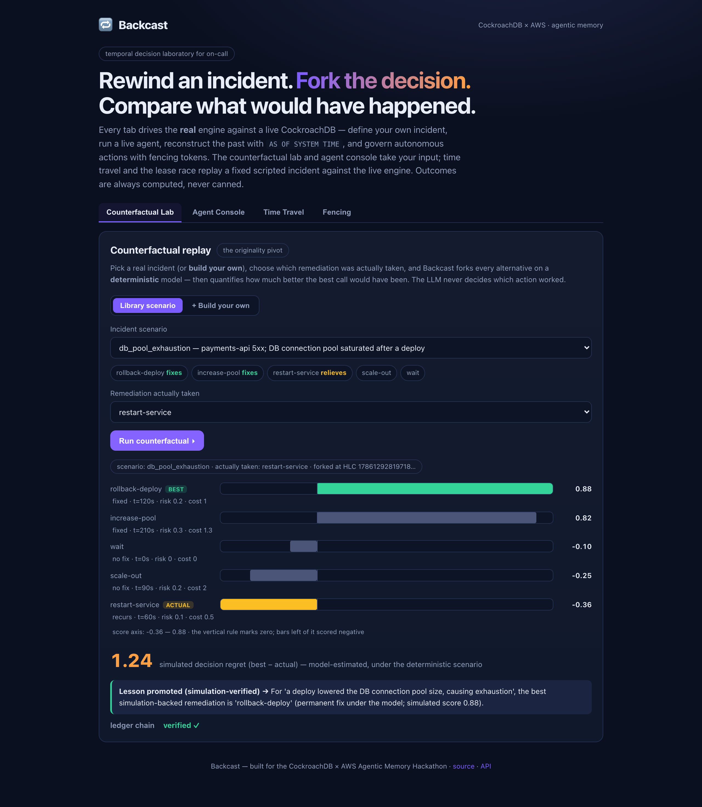
</p>

<p align="center">
  <em>Every screenshot is a real run against a live CockroachDB cluster — no mockups. The agent
  console is a live Amazon Nova Pro call on the deployed Lambda.</em>
</p>

<table>
<tr>
<td width="50%">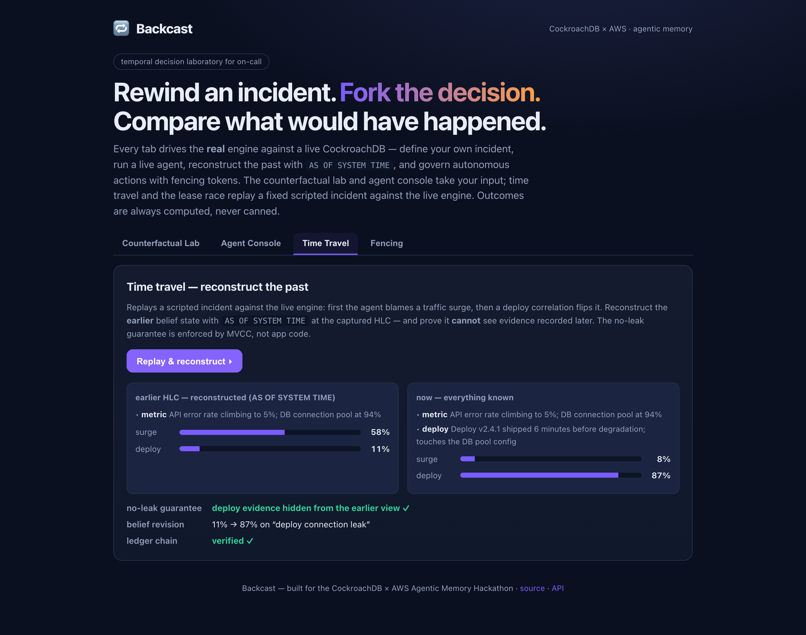</td>
<td width="50%">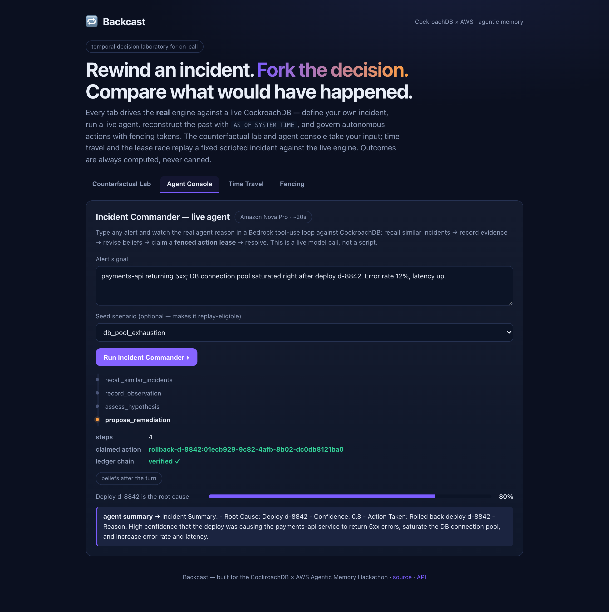</td>
</tr>
<tr>
<td align="center"><b>Temporal reconstruction</b> — what the agent believed at an earlier HLC, with future evidence provably hidden by MVCC</td>
<td align="center"><b>Live agent</b> — a real Bedrock tool-use loop that ends by claiming a <b>fenced action lease</b></td>
</tr>
</table>

---

> **An on-call engineer restarts a service and the alert clears. Incident resolved — or was it?**
>
> Backcast rewinds to the moment of decision, **forks the incident**, and replays the alternatives
> against a *deterministic* incident model. The restart only *relieved* the symptom (it would recur).
> A deploy rollback was the permanent fix. Backcast quantifies the gap — **decision regret** — and
> writes the verified lesson back into the agent's memory:

```text
REWIND → FORK → COMPARE   (outcomes computed deterministically, not by an LLM)

  branch                 score  result   t(s)  risk   note
  fork:rollback-deploy    0.88  fixed     120   0.2   ★ BEST
  fork:increase-pool     0.818  fixed     210   0.3
  actual (restart)       -0.36  recurs     60   0.1   ← what we actually did
  fork:wait               -0.10 no fix       0   0.0

  simulated decision regret (best − actual) = 1.24   ← under the deterministic model, not observed in prod
  lesson promoted → "For a deploy that shrank the DB pool, the best simulation-backed remediation is
                     rollback-deploy (permanent fix in the model)."
```

That loop — *reconstruct the past, fork it, simulate alternatives, and learn which decision was
best* — is only tractable because operational state, evidence, beliefs, actions, and vectors live in
**one transactionally-consistent, time-travelling database**. The outcome is computed by
[`simulation/model.py`](./src/backcast/simulation/model.py) — the LLM may *propose* alternatives but
never decides whether one succeeded.

## In one picture

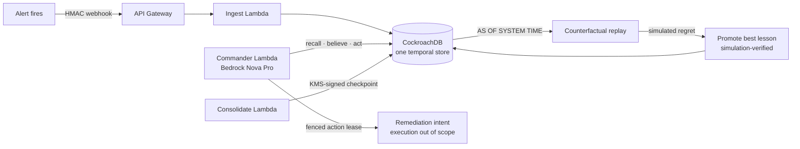

An alert becomes an incident; the **Commander** agent recalls similar past incidents (vector search),
records evidence, revises time-versioned beliefs, and claims a **fenced action lease** for the
remediation it selects (executing it is out of scope — see [`THREAT_MODEL.md`](./docs/THREAT_MODEL.md) §6).
After resolution, Backcast **rewinds** to the decision point, **forks** alternative remediations,
scores each with a deterministic model, and **promotes the best simulation-backed remediation** back into memory. Every
step is written to a hash-chained ledger with periodic **KMS-signed checkpoints**.

## Live on AWS

Backcast is **deployed and running** on AWS + CockroachDB Cloud — not a slideware demo. Click the web
UI and drive all three headline mechanisms live from your browser:

| What | URL | Auth |
|------|-----|------|
| 🖥️ **Interactive demo (React UI)** | **https://2beyv24r657kdthgabtbvg74n40pyolu.lambda-url.us-east-1.on.aws/** | open |
| 🔒 Signed webhook ingress (API Gateway, throttled) | `https://1a1x8v25m9.execute-api.us-east-1.amazonaws.com/prod/incidents` | HMAC |
| 🤖 Commander (one agent turn, Amazon Nova Pro) | `https://u754vo546smuamntvsvicdngfe0otxdc.lambda-url.us-east-1.on.aws/` | open (demo) |
| 📥 Ingest (Function URL) | `https://sanik5tdc2qb2uy5hxchobelsa0qagzj.lambda-url.us-east-1.on.aws/` | HMAC |

The ingress is **HMAC-verified** — an unsigned `POST` returns `401` by design. Reproduce the full
live flow with [`./test-endpoints.sh`](./test-endpoints.sh) (automated E2E). See
[`docs/DEMO.md`](./docs/DEMO.md) for the guided walkthrough.

## Documentation

| Document | What's inside |
|----------|---------------|
| [`docs/ARCHITECTURE.md`](./docs/ARCHITECTURE.md) | Full architecture deep-dive — data flows, temporal & counterfactual internals, deployment, cost |
| [`docs/MEMORY_MODEL.md`](./docs/MEMORY_MODEL.md) | The six memory tiers, their tables, and the CockroachDB feature each relies on |
| [`docs/THREAT_MODEL.md`](./docs/THREAT_MODEL.md) | Trust boundaries, threats (key leak, ledger tampering, split-brain actions, replay, temporal leak, prompt injection) → mitigations |
| [`docs/SECURITY.md`](./docs/SECURITY.md) | Security controls summary (IAM, secrets, HMAC, KMS, fencing) |
| [`docs/openapi.yaml`](./docs/openapi.yaml) | OpenAPI 3.0 spec for the deployed API (also served at `GET /openapi.yaml`) |
| [`docs/GLOSSARY.md`](./docs/GLOSSARY.md) | Every project term defined — HLC, MVCC, C-SPANN, fencing token, decision regret, … |
| [`docs/DEMO.md`](./docs/DEMO.md) | Shot-by-shot demo recording script against the live UI |

## The problem

On-call fights the same fires repeatedly, and post-incident reviews ask two brutal questions: *"what
did we know, and when?"* and *"was that the right call?"* A stateless copilot answers neither, and a
bolt-on vector store has no notion of time, transactional consistency, or *counterfactuals* — so it
cannot reconstruct a past belief state without leaking hindsight, cannot prove a decision was best,
and cannot coordinate an autonomous action safely across crashing workers.

Backcast keeps everything in CockroachDB, which makes five things possible **without operating a
separate event-sourced database and a synchronized vector store**:

| # | Mechanism | CockroachDB capability |
|---|-----------|------------------------|
| 1 | **Counterfactual replay** — fork a resolved incident, simulate alternative remediations, rank them, compute *decision regret*, promote the winner to memory | one transactional store for branches, outcomes, and the memory they feed |
| 2 | **Temporal reconstruction** — *"what did the agent believe at 03:14?"* with **no future-evidence leak** | `AS OF SYSTEM TIME` at a captured HLC; MVCC enforces no-leak, not app filtering |
| 3 | **Versioned belief history + provenance** — which evidence changed the agent's mind, and when | bitemporal `beliefs` (`valid_from/until`, `superseded_by`) + a typed provenance graph |
| 4 | **Fencing-safe autonomy** — one of N workers acts; a crashed/paused worker can't finalize after takeover | `UNIQUE(org_id, action_key)` claim + **fencing generation** + a recorded idempotency key |
| 5 | **Evidence-preserving memory** — learn without corrupting the record; durable audit | immutable evidence; retrieval-decayed semantic/procedural; hash-chained ledger + signed checkpoints |

## A note on precise claims

The reviewer was right to demand precision, so:

- **Not "exactly-once" external effects.** A database transaction cannot atomically commit with an
  external AWS side effect. Backcast guarantees **exactly one current logical owner and one canonical
  action intent**, carried by a fencing token (`lease_generation`, bumped on takeover) plus a
  recorded idempotency key that would make an executor safely repeatable. A stale worker that
  "revives" after takeover is **fenced out** (see `make race-demo`). **Executing the remediation is
  out of scope in this build** — the agent claims the lease and stops; no external system is
  mutated, and there is no state-verification step because there is nothing to verify against.
- **Not "append-only" beliefs.** It's a **versioned belief history**: belief *content* is immutable
  and superseded explicitly (`valid_until`, `superseded_by`); the supersession itself is recorded in
  the ledger.
- **Tamper-evident, not tamper-proof.** The per-incident **hash-chained** `event_ledger` detects any
  edit that doesn't also rewrite every subsequent hash. For integrity beyond a DBA's reach, Backcast
  signs periodic **root-hash checkpoints with AWS KMS** (ECDSA P-256), with optional **S3 Object
  Lock** export. Deletion is also blocked structurally: `evidence`, `event_ledger` and
  `ledger_checkpoints` reference `incidents` with **`ON DELETE RESTRICT`**, so removing an incident
  that has recorded history is refused rather than quietly cascading the audit trail away
  (migration `0006`). Derived, recomputable tables still cascade.
- **Time-travel isn't free** — it avoids running *two* synchronized stores, but retention is bounded
  by the GC window, which is why the append-only ledger + signed S3 packages carry durable history.
- **Vector metric.** Titan v2 embeddings are L2-normalized, so an **L2** index is
  **ranking-equivalent** to cosine (the distances differ; the ordering doesn't). Verified on
  CockroachDB **v26.2**; historical (`AS OF SYSTEM TIME`) recall uses **exact** distance over a
  bounded set rather than assuming ANN acceleration.

## Quick start

### Run it locally (offline, no AWS)

```bash
make bootstrap          # uv-managed venv + dev deps
make db-up              # local CockroachDB (docker) + schema migration
uv run backcast counterfactual   # ⭐ rewind → fork → compare → learn
uv run backcast demo             # the five memory mechanisms, narrated
make race-demo                   # 25-worker lease race + crash + fencing
make web                         # interactive UI at http://localhost:8000
```

Everything runs offline with deterministic hash embeddings; add `--bedrock` for Amazon Titan.

### Deploy your own to AWS

```bash
cd infra && uv run cdk deploy --require-approval never
# then put your CockroachDB DSN (+ CA cert) into the created secret:
aws secretsmanager put-secret-value --secret-id backcast/database-url \
  --secret-string '{"url":"postgresql://…:26257/backcast?sslmode=verify-full","ca_cert":"-----BEGIN…"}'
```

One `cdk deploy` provisions 4 Lambdas (ingest / commander / consolidate / webapp), the HMAC-verified
API Gateway, the KMS signing key, EventBridge schedule, CloudWatch dashboard + alarms, and S3. Then
set the DSN secret and apply the migrations (see [`docs/ARCHITECTURE.md`](./docs/ARCHITECTURE.md#13-deployment)).

### Verify it

```bash
make test               # unit + property-based tests (hypothesis) — no DB/AWS needed
make test-integration   # live-DB integration tests (against local CockroachDB)
./test-endpoints.sh     # automated E2E checks against the deployed API
```

## How it works — step by step

### The full incident lifecycle

Every incident flows through the same pipeline; the **counterfactual replay** at the end is what
makes Backcast a *decision laboratory* rather than a memory cache.

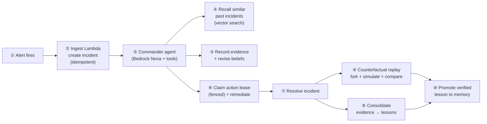

1. **Alert fires** — Alertmanager/PagerDuty POSTs a webhook.
2. **Ingest** turns it into an `incidents` row, idempotent on the alert *fingerprint* (`external_id`).
3. **Commander** — the agent reasons in a Bedrock tool-use loop.
4. **Recall** — C-SPANN vector search finds semantically similar past evidence.
5. **Evidence + beliefs** — each observation is immutable; each hypothesis gets a calibrated,
   *time-versioned* confidence.
6. **Action lease** — the agent claims an exclusive, fenced lease for the action it selects (see below). Execution is out of scope in this build.
7. **Resolve** — the incident's state machine advances; `state_version` bumps.
8. **Consolidate** (scheduled) — distills the closed incident into semantic/procedural memory.
9. **Counterfactual replay** — forks the incident and simulates alternatives.
10. **Promote** — the best simulation-backed remediation is promoted as a *candidate* procedure
    (marked simulation-verified — reproducible under the model, not yet observed in production).

### ① Counterfactual replay — rewind → fork → compare → learn

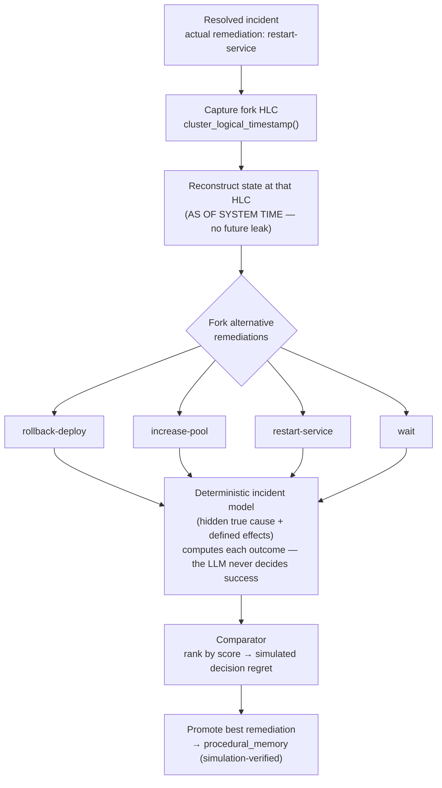

The model scores each branch on **recovery (permanent vs. temporary), time-to-recovery, unnecessary
actions, risk, and cost**. *Simulated decision regret* = `best.score − actual.score` — a
**model-estimated** quantity (it proves which branch scores best *under the encoded scenario model*,
not what production would have done). Persisted to `incident_branches`, `branch_outcomes`, and
`simulation_runs`.

### ② Temporal reconstruction — the no-leak guarantee

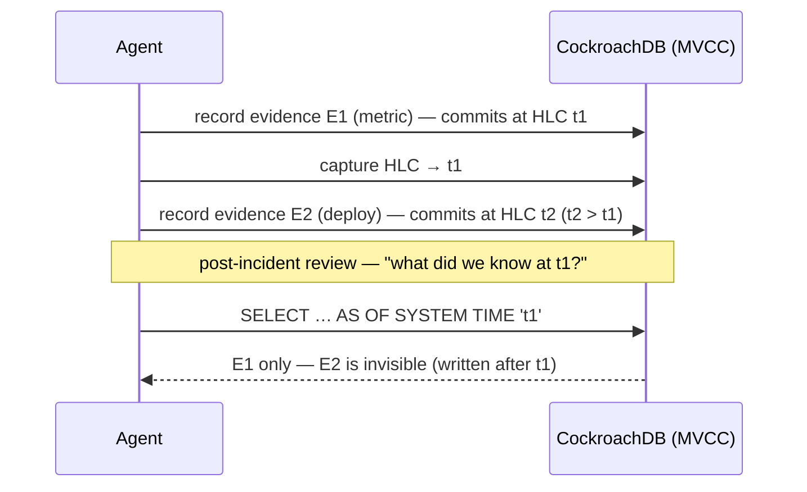

Because the past view is a real MVCC snapshot, evidence written later **cannot** leak into it — the
guarantee is enforced by the database, not by application filtering.

### ③ Fenced action lease — one action, once, even across crashes

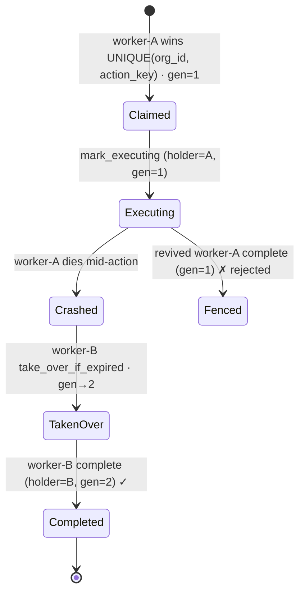

A `UNIQUE(org_id, action_key)` gives exactly one owner; a **fencing generation** (bumped on takeover)
means a revived stale worker is rejected; an idempotency key makes the external effect safely
repeatable. Backcast does **not** claim "exactly-once external effects" — it guarantees *one canonical
action intent with safe repetition*.

Driven live from the browser — 20 workers race for the same action, the holder is crashed mid-flight,
a second worker takes over, and the revived original is fenced out:

<p align="center">
  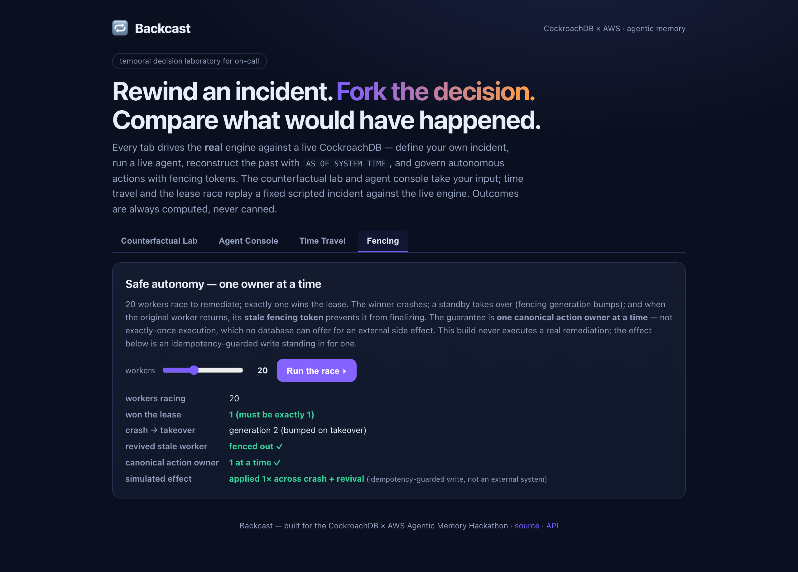
</p>

### The memory model

| Tier | Table(s) | Mutability | CockroachDB feature |
|------|----------|------------|---------------------|
| **Episodic** | `evidence`, `event_ledger` | **immutable** (append-only) | `VECTOR` + C-SPANN recall; hash chain; HLC `db_ts` |
| **Belief** | `hypotheses`, `beliefs`, `provenance_edges` | versioned (immutable content + supersession) | bitemporal columns, partial index, `AS OF SYSTEM TIME` |
| **Semantic / Procedural** | `semantic_memory`, `procedural_memory` | revisable + retrieval-decayed | `VECTOR` + C-SPANN, `superseded_by` |
| **Working** | `working_memory` | disposable | **Row-Level TTL** (safe to physically delete) |
| **Action** | `action_leases` | transactional | `UNIQUE` claim + fencing generation + idempotency |
| **Counterfactual** | `incident_branches`, `branch_outcomes`, `simulation_runs` | append-only | forks + deterministic outcomes + regret |

See [`docs/MEMORY_MODEL.md`](./docs/MEMORY_MODEL.md) and the fully-commented
[`db/migrations/`](./db/migrations/).

## Architecture

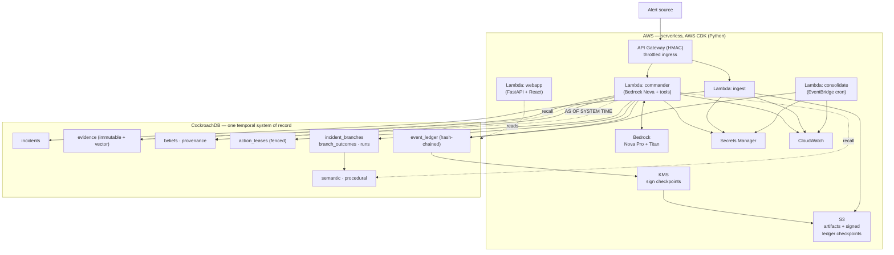

## API endpoints

| Method | Path / entry point | Auth | Description |
|--------|--------------------|------|-------------|
| `POST` | `/prod/incidents` (API Gateway) | **HMAC** | Signed alert webhook → incident (idempotent on fingerprint) |
| `POST` | Ingest Function URL | **HMAC** | Same, direct Function URL (unsigned ⇒ `401`) |
| `POST` | Commander Function URL | open (demo) | Run one agent turn — `{org_id, incident_id, signal}` |
| `GET`  | `/` (webapp) | open | Interactive React demo UI |
| `GET`  | `/health` | open | CockroachDB liveness probe |
| `GET`  | `/api/scenarios` | open | The built-in incident scenario library (true cause + remediations) |
| `POST` | `/api/counterfactual` | open | Rewind → fork → compare → learn (pick a scenario + the action taken) |
| `POST` | `/api/simulate` | open | **Build-your-own** counterfactual — a fully custom incident → live regret |
| `POST` | `/api/agent` | open | **Live Incident Commander turn** (Amazon Nova Pro tool-use loop) |
| `POST` | `/api/incident` | open | Belief revision + temporal no-leak reconstruction |
| `POST` | `/api/race` | open | Concurrency + fencing (N workers, crash & fenced takeover) |
| `GET`  | `/openapi.yaml` | open | OpenAPI 3.0 spec (Swagger UI at `/docs`) |

Full request/response schemas: [`docs/openapi.yaml`](./docs/openapi.yaml). HMAC signing scheme:
sign `"<unix_ts>." + body` with the shared secret (HMAC-SHA256); send `x-backcast-timestamp` and
`x-backcast-signature: sha256=<hex>` (max age 300 s).

## Design decisions

| Decision | Rationale |
|----------|-----------|
| **One CockroachDB** for state + beliefs + vectors + ledger | No synchronized event-store + vector-store to keep consistent; `AS OF SYSTEM TIME` works across *all* of it |
| `AS OF SYSTEM TIME` for temporal recall | MVCC enforces the no-future-leak guarantee at the database, not by fragile app-side filtering |
| **L2** vector index (not a cosine op class) | v26.2 C-SPANN ships the L2 op class; Titan v2 vectors are normalized, so L2 ranking ≡ cosine ranking |
| **Fencing generation** on action leases | A revived stale worker after takeover is rejected — no split-brain external effects |
| **Deterministic** incident model for counterfactuals | Outcomes must be reproducible and trustworthy; the LLM *proposes* remediations but never scores success |
| Hash-chain **+ KMS-signed** checkpoints | Tamper-evidence inside the DB, plus integrity beyond a DBA via KMS ECDSA P-256 signatures |
| **HMAC + API Gateway throttling** for ingress | A public webhook must authenticate callers and resist floods (rate 20 / burst 10) |
| **Amazon Nova Pro** (not Claude) | Works out-of-the-box on the account; Claude-ready via `cdk deploy -c bedrock_model_id=…` |
| **Container-image** Lambdas, one shared image | `psycopg` needs native libs; one build serves all handlers via different `cmd` |
| **uv + ruff + mypy `--strict` + pytest** | Reproducible env, typed, lint- and type-clean, CI-gated |

## Project structure

```
backcast/
├── src/backcast/
│   ├── api/                 # Lambda handlers
│   │   ├── ingest.py        #   alert webhook → incident (HMAC-verified)
│   │   ├── commander.py     #   one agent turn (Bedrock)
│   │   ├── consolidate.py   #   scheduled consolidation + KMS checkpoint
│   │   ├── security.py      #   HMAC signing / verification
│   │   ├── http.py          #   request/response helpers
│   │   └── runtime.py       #   warm engine, Secrets Manager, S3
│   ├── agent/               # the SRE Incident Commander
│   │   ├── commander.py     #   tool-use reasoning loop
│   │   ├── llm.py           #   Bedrock Converse + offline scripted LLM
│   │   ├── tools.py         #   recall / observe / assess / remediate / resolve
│   │   └── prompts.py
│   ├── memory/              # the memory engine (one facade over CockroachDB)
│   │   ├── engine.py        #   wires every store together
│   │   ├── evidence.py beliefs.py incidents.py leases.py ledger.py
│   │   ├── temporal.py      #   AS OF SYSTEM TIME reconstruction + historical recall
│   │   ├── checkpoints.py   #   KMS / HMAC-signed ledger checkpoints
│   │   ├── semantic.py procedural.py consolidation.py
│   │   ├── embeddings.py scoring.py models.py
│   ├── simulation/          # the counterfactual core
│   │   ├── scenarios.py     #   hidden true cause + remediation effects
│   │   ├── model.py         #   deterministic outcome + scoring
│   │   ├── comparator.py    #   rank branches → decision regret
│   │   └── branches.py      #   orchestrate fork → simulate → compare → promote
│   ├── webapp/              # FastAPI + Mangum; serves the built React UI
│   ├── db/                  # connection + idempotent migration runner
│   ├── cli.py config.py telemetry.py
├── db/migrations/           # 0001_init … 0005_ledger_checkpoints (fully commented)
├── infra/backcast_infra/    # AWS CDK stack (BackcastStack)
├── web/                     # React + Vite + TypeScript source (builds into webapp/static)
├── scripts/                 # bootstrap_cockroach.sh, load_seed_data.py, concurrency_demo.py
├── tests/                   # unit + property-based (hypothesis) + live-DB integration
├── docs/                    # architecture, threat model, memory model, glossary, demo, openapi
├── test-endpoints.sh
└── Dockerfile Makefile pyproject.toml
```

## Tech stack

| Layer | Technology |
|-------|-----------|
| Language | Python 3.13 (`__future__` annotations, typed `--strict`) |
| Database | **CockroachDB** — `AS OF SYSTEM TIME`, C-SPANN vector index, Row-Level TTL, HLC. Deployed against Cloud **v26.2**; CI runs **v25.2**, the minimum for C-SPANN vector indexing |
| Reasoning | Amazon **Bedrock** — Nova Pro (Converse + tool use) + Titan v2 embeddings |
| Compute | AWS **Lambda** (ARM64 container images), **API Gateway** HTTP API |
| Security | **KMS** (ECDSA P-256), **Secrets Manager**, HMAC webhooks, least-privilege IAM |
| Ops | **EventBridge** (cron), **CloudWatch** (dashboard + alarms), **S3** |
| IaC | AWS **CDK** (Python) — one `cdk deploy` |
| Web UI | **React** + Vite + TypeScript · FastAPI + Mangum |
| Tooling | **uv**, **ruff**, **mypy --strict**, **pytest** + **hypothesis**, GitHub Actions CI |

## Tools & services (hackathon requirements)

**CockroachDB tools** (requires ≥ 2 — Backcast uses three at runtime): **Distributed Vector Indexing
(C-SPANN)** for evidence/semantic/procedural recall; **ccloud CLI** for cluster/DB provisioning
([`scripts/bootstrap_cockroach.sh`](./scripts/bootstrap_cockroach.sh)); and the **Agent Skills** repo
in the dev loop. The **Managed MCP Server** was used during development for read-only DB inspection —
a read-only "explain this incident" auditor over MCP is on the roadmap, not on the runtime agent path.

**AWS services** (requires ≥ 1 — Backcast uses several): Amazon **Bedrock** (Nova Pro reasoning +
Titan embeddings — Claude-ready once account access is enabled) · AWS **Lambda** (container images) ·
Amazon **S3** · **EventBridge** · **Secrets Manager** · **CloudWatch** · **KMS** (ledger checkpoint
signing) · **API Gateway** (HMAC-verified, throttled ingress) — all via the **AWS CDK** in Python.

## How it maps to the judging criteria

| Criterion | How Backcast delivers |
|-----------|----------------------|
| **Agentic Memory Design** | Six memory tiers in one system: immutable evidence, versioned beliefs + provenance, transactional fenced actions, decayed long-term memory, and counterfactual branches — no ETL, no cross-store drift. |
| **Technological Implementation** | Correct, precise use of `AS OF SYSTEM TIME`, C-SPANN vectors, fencing tokens, Row-Level TTL, hash chains. Typed (`mypy --strict`), tested (unit + property-based + live-DB integration), CI-gated. |
| **Real-World Impact** | On-call is universal and expensive. Backcast compounds institutional knowledge *and* compares decisions reproducibly under an explicit deterministic model — then remembers the best simulation-backed one. |
| **Product Readiness** | Least-privilege IAM, Secrets Manager, fenced + idempotent actions, tamper-evident ledger (KMS-signed checkpoints), HMAC-verified throttled ingress, structured logs, alarms. See [`docs/SECURITY.md`](./docs/SECURITY.md). |
| **Creativity & Originality** | Transactionally-consistent counterfactual replay of agent decisions, with *simulated* decision regret and simulation-verified-lesson promotion — not generic incident recall. |

## Real-world impact

- **On-call is universal and expensive.** Every SaaS team runs incidents; the knowledge earned at
  03:00 usually evaporates by the next rotation. Backcast makes it *compound* — recall, belief
  history, and verified lessons persist across incidents and people.
- **Post-incident reviews get an honest referee.** *Decision regret* turns "we think the rollback was
  better" into a reproducible number, computed by a deterministic model rather than argued in a
  retro.
- **A reusable reference architecture.** Temporal no-leak recall, fencing-safe autonomous actions,
  and hash-chain + KMS tamper-evidence are patterns any agentic system that *takes actions* needs —
  not just SRE.
- **Safe autonomy.** The fencing + idempotency pattern lets an agent act on the
  world without split-brain double-execution when workers crash or pause.

## Roadmap

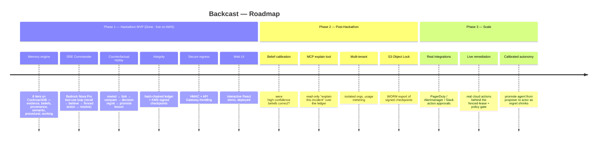

## Status

🚀 Deployed & live (deadline **Aug 18, 2026**). **Done & tested:** memory engine, the SRE agent loop,
consolidation, temporal + historical reconstruction, fencing, the **counterfactual replay core**,
KMS-signed ledger checkpoints, HMAC-verified API Gateway ingress, and the React web UI. The full
`BackcastStack` (4 Lambdas incl. the React UI + API Gateway + KMS) is **deployed and smoke-tested
end-to-end on AWS + CockroachDB Cloud** — signed ingest → agent turn (Amazon Nova Pro) → fenced action
lease → resolve → KMS-signed checkpoint, all verified live. **Remaining:** the < 3-min demo video.

## License

[Apache License 2.0](./LICENSE) — © 2026 Umar Hashmi. Built during the hackathon submission period.
