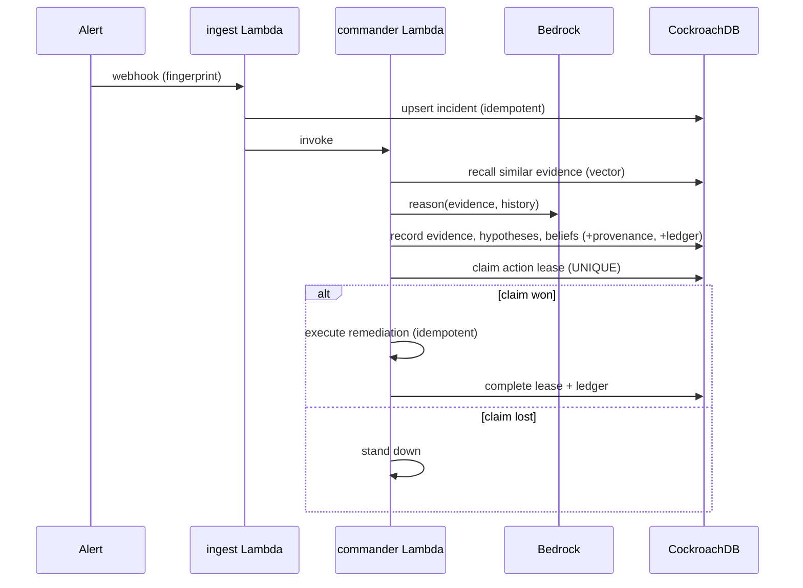

# Architecture

Backcast is an SRE Incident Commander whose **memory is a single CockroachDB cluster** and whose
**runtime is AWS serverless**. The design goal is that operational state, evidence, embeddings,
beliefs, and decisions never leave one transactional, temporal system of record.

## Components

| Layer | Piece | Responsibility |
|-------|-------|----------------|
| Ingress | Function URL → `ingest` Lambda | Turn an alert into an incident (idempotent on the source fingerprint), stash raw payload in S3. |
| Reasoning | `commander` Lambda + Bedrock | Recall similar evidence, form/revise hypotheses & beliefs, decide on remediation. |
| Action | `ActionLeaseCoordinator` | Grant exactly one worker the right to execute an action; idempotent, crash-safe. |
| Memory | CockroachDB | Evidence, beliefs, provenance, leases, ledger, long-term memory. |
| Reflection | `consolidate` Lambda (EventBridge) | Distill closed incidents into semantic/procedural memory; decay retrieval scores. |
| Observability | CloudWatch + `event_ledger` | Structured logs/metrics + a permanent, tamper-evident decision trail. |

## Why one database (the core bet)

A conventional stack splits an operational DB from a vector store. To answer *"what did the agent
believe at 03:14?"* that stack must event-source its operational data **and** version its vectors
**and** keep the two synchronized. Backcast gets a transactionally-consistent point-in-time view
**without operating two separate, synchronized stores** — though this trades design and storage cost,
not literally "for free":

- **System-time travel** — `AS OF SYSTEM TIME <hlc>` reconstructs the exact committed state. Evidence
  written later is invisible because of MVCC. We capture `cluster_logical_timestamp()` (`db_ts`) at
  each write so reconstruction is precise. Historical *recall* uses exact distance over a bounded set
  (ANN acceleration is not assumed inside a historical read).
- **Application-time versioning** — `beliefs.valid_from/valid_until` form a versioned history of the
  agent's beliefs (immutable content, explicit supersession), independent of the GC window.
- **Vectors next to the truth** — C-SPANN indexes live in the same tables as the operational rows, so
  recall is always consistent with state; no ETL, no drift.

## Data flow (incident lifecycle)

## Retention story (be precise)

`AS OF SYSTEM TIME` only works inside the configured GC window. For durable audit we keep the
append-only, hash-chained `event_ledger` (permanent) and export **signed incident packages** to S3 on
closure. Row-Level TTL is used **only** for disposable `working_memory` — never for evidence.

## Failure modes

| Failure | Mitigation |
|---------|-----------|
| Duplicate alerts / duplicate workers | `UNIQUE(org_id, external_id)` incidents; `UNIQUE(org_id, action_key)` leases. |
| Executor crash mid-action | Lease expiry + `take_over_if_expired`; idempotency key blocks re-execution. |
| Serialization conflict on ledger append | Retry with backoff on `40001`/unique violation. |
| CockroachDB transient error | `tenacity` retry on `OperationalError`; connection liveness check on warm Lambda. |
| Bad/poisoned consolidation | Evidence is immutable; only revisable layers change; facts are versioned and superseded. |
