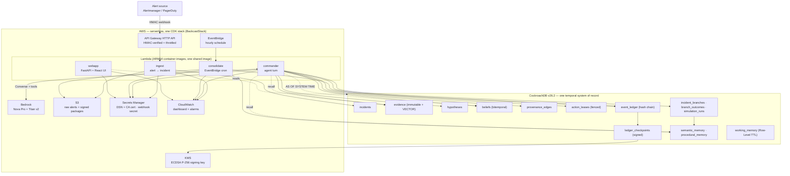
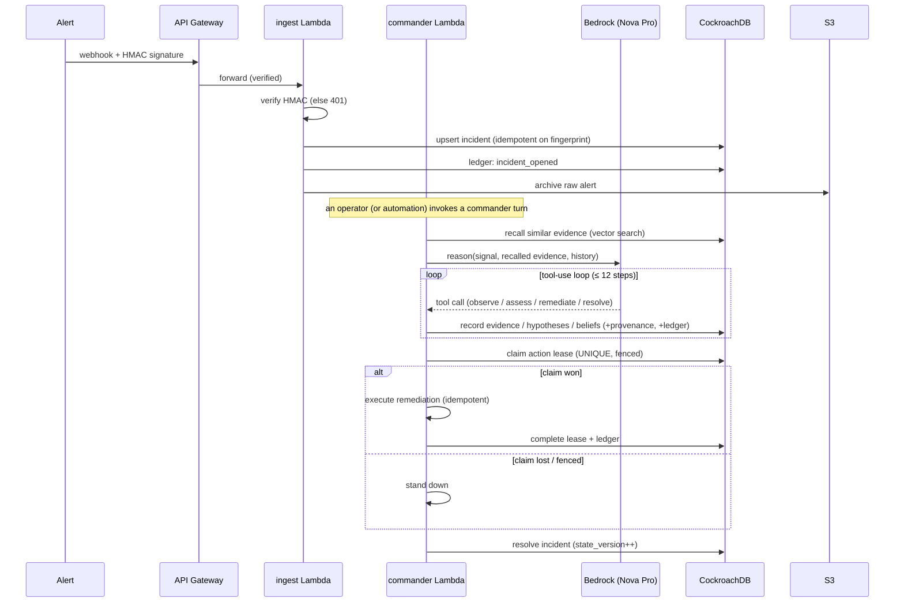
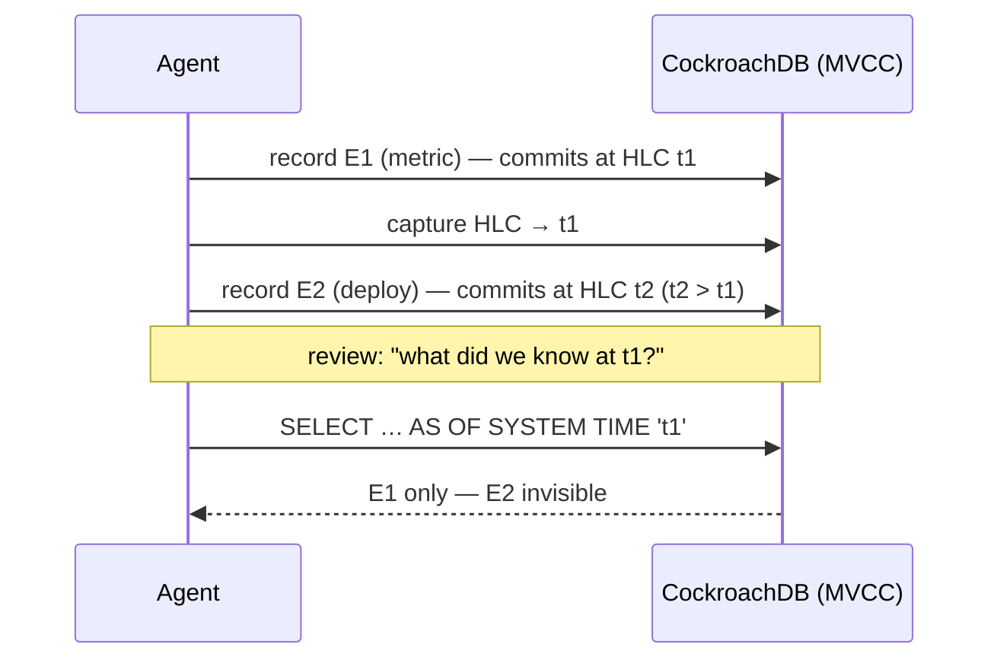
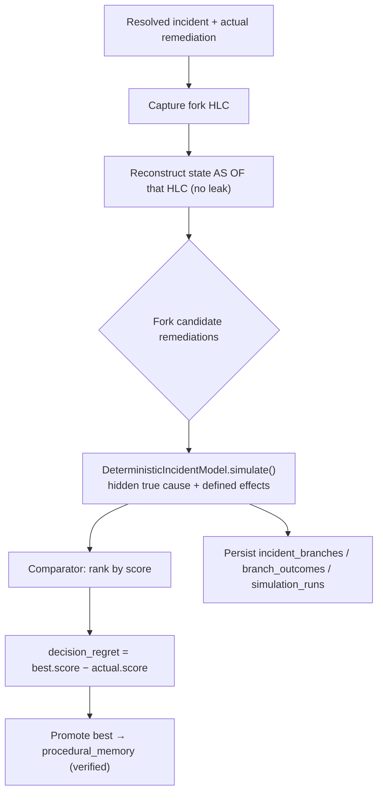
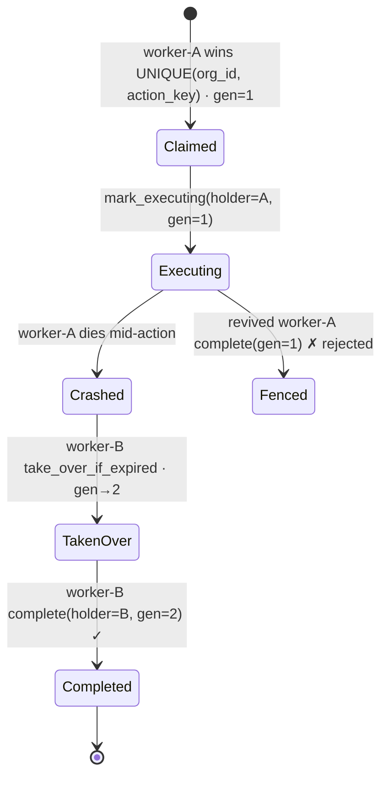

# Architecture — Backcast

Backcast is an SRE Incident Commander whose **memory is a single CockroachDB cluster** and whose
**runtime is AWS serverless**. The design goal is that operational state, evidence, embeddings,
beliefs, actions, and counterfactual decisions never leave one transactional, temporal system of
record — so the system can reconstruct any past belief state, compare decisions reproducibly under an
explicit deterministic model, and act
autonomously without split-brain double-execution.

This document is the deep-dive. For the narrative overview see the [README](../README.md); for the
data model see [MEMORY_MODEL.md](./MEMORY_MODEL.md); for the security analysis see
[THREAT_MODEL.md](./THREAT_MODEL.md).

## Contents

1. [System overview](#1-system-overview)
2. [Why one database (the core bet)](#2-why-one-database-the-core-bet)
3. [The memory model](#3-the-memory-model)
4. [Incident lifecycle (data flow)](#4-incident-lifecycle-data-flow)
5. [Temporal reconstruction internals](#5-temporal-reconstruction-internals)
6. [Counterfactual engine internals](#6-counterfactual-engine-internals)
7. [Action leases + fencing](#7-action-leases--fencing)
8. [Ledger + KMS-signed checkpoints](#8-ledger--kms-signed-checkpoints)
9. [Vector recall](#9-vector-recall)
10. [The agent (Bedrock tool-use loop)](#10-the-agent-bedrock-tool-use-loop)
11. [AWS infrastructure (CDK)](#11-aws-infrastructure-cdk)
12. [Security controls summary](#12-security-controls-summary)
13. [Deployment](#13-deployment)
14. [Environment variables](#14-environment-variables)
15. [Cost model](#15-cost-model)
16. [Failure modes](#16-failure-modes)
17. [Testing strategy](#17-testing-strategy)

## 1. System overview



| Layer | Piece | Responsibility |
|-------|-------|----------------|
| Ingress | API Gateway + `ingest` Lambda | HMAC-verify the webhook, turn an alert into an incident (idempotent on the source fingerprint), archive the raw payload to S3. |
| Reasoning | `commander` Lambda + Bedrock | Recall similar evidence, form/revise hypotheses & beliefs, claim a fenced lease, decide on and execute remediation. |
| Reflection | `consolidate` Lambda (EventBridge) | Distill closed incidents into semantic/procedural memory; decay retrieval scores; write a signed ledger checkpoint. |
| Presentation | `webapp` Lambda (FastAPI + React) | Serve the interactive demo UI and the counterfactual / temporal / fencing panels. |
| Memory | CockroachDB | Evidence, beliefs, provenance, leases, ledger, checkpoints, counterfactual branches, long-term memory. |
| Observability | CloudWatch + `event_ledger` | Structured logs/metrics + a permanent, tamper-evident decision trail. |

## 2. Why one database (the core bet)

A conventional stack splits an operational DB from a vector store. To answer *"what did the agent
believe at 03:14?"* that stack must event-source its operational data **and** version its vectors
**and** keep the two synchronized. Backcast gets a transactionally-consistent point-in-time view
**without operating two separate, synchronized stores** — this trades design and storage cost, not
literally "for free":

- **System-time travel** — `AS OF SYSTEM TIME <hlc>` reconstructs the exact committed state. Evidence
  written later is invisible because of MVCC. We capture `cluster_logical_timestamp()` (`db_ts`) at
  each write so reconstruction is precise. Historical *recall* uses exact distance over a bounded set
  (ANN acceleration is not assumed inside a historical read).
- **Application-time versioning** — `beliefs.valid_from/valid_until` form a versioned history of the
  agent's beliefs (immutable content, explicit supersession), independent of the GC window.
- **Vectors next to the truth** — C-SPANN indexes live in the same tables as the operational rows, so
  recall is always consistent with state; no ETL, no drift.
- **Transactional counterfactuals** — a fork reads a consistent historical snapshot and writes its
  branches/outcomes in the same store that feeds the agent's memory, so a promoted lesson is
  immediately and consistently visible.

## 3. The memory model

Six tiers, one cluster. Full column-level detail in [MEMORY_MODEL.md](./MEMORY_MODEL.md) and the
fully-commented [`db/migrations/`](../db/migrations/).

| Tier | Table(s) | Mutability | Key CockroachDB feature |
|------|----------|------------|-------------------------|
| **Episodic** | `evidence`, `event_ledger` | immutable (append-only) | `VECTOR(1024)` + C-SPANN; sha256 hash chain; HLC `db_ts` |
| **Belief** | `hypotheses`, `beliefs`, `provenance_edges` | versioned content + explicit supersession | bitemporal `valid_from/valid_until`, partial index on current rows, `AS OF SYSTEM TIME` |
| **Semantic** | `semantic_memory` | revisable + retrieval-decayed | `VECTOR` + C-SPANN, `superseded_by` |
| **Procedural** | `procedural_memory` | revisable | verified lessons promoted from counterfactuals |
| **Working** | `working_memory` | disposable | **Row-Level TTL** (safe physical delete) |
| **Action** | `action_leases` | transactional | `UNIQUE(org_id, action_key)` + `lease_generation` + idempotency key |
| **Counterfactual** | `incident_branches`, `branch_outcomes`, `simulation_runs` | append-only | forks + deterministic outcomes + regret |

**Invariant:** evidence and ledger entries are never mutated or deleted. Learning happens only in the
revisable tiers (semantic/procedural) and via explicit belief supersession; the record of *what
happened* is immutable.

## 4. Incident lifecycle (data flow)



## 5. Temporal reconstruction internals

The no-leak guarantee is the property that a reconstruction of the past **cannot** contain evidence
that was written after the reconstruction point. Backcast enforces it at the database, not in
application code.

1. Every write records `db_ts = cluster_logical_timestamp()` — the commit HLC.
2. To "remember what we knew at t₁", the agent captures an HLC (`capture_hlc()`), then reads
   `... AS OF SYSTEM TIME <t₁>`.
3. Because that read is a real MVCC snapshot, rows committed after t₁ are simply not visible.



`TemporalReconstructor.reconstruct(incident_id, hlc)` returns the evidence + current beliefs as of the
HLC. `historical_recall(org_id, query_embedding, as_of_hlc, …)` does cross-incident vector recall as
of a past HLC, using **exact** cosine over the bounded candidate set (org + HLC are validated against
strict regexes before being inlined, since `AS OF SYSTEM TIME` cannot be parameterized). Retention is
bounded by the GC window — see [§8](#8-ledger--kms-signed-checkpoints) for durable history.

## 6. Counterfactual engine internals

The originality pivot: rewind a resolved incident, fork alternative remediations, simulate each with a
**deterministic** model, rank them, compute *simulated decision regret*, and promote the best
simulation-backed remediation to procedural memory as a **candidate** procedure. The LLM may
*propose* remediations, but it never decides whether one succeeded — and "best" means best *under the
encoded scenario model*, not proven best in production.



**Scenario** (`simulation/scenarios.py`) — a hidden `true_cause` plus a map of candidate remediations
to `RemediationEffect(fixes, relieves, recovery_seconds, risk, cost)`. `fixes` permanently resolves
the true cause; `relieves` buys time but the symptom recurs; neither ⇒ a wasted action.

**Model** (`simulation/model.py`) — `simulate()` applies the remediation sequence and classifies the
outcome (recovered / recurred / unnecessary actions / time / risk / cost). Scoring:

```text
score = base − penalties
  base      = 1.0 if recovered else 0.0
  penalties = 0.10·unnecessary + 0.20·risk + 0.04·cost
            + 0.20·min(1, time/600) + (0.30 if recurred)
```

This yields the provable invariants the property tests assert: `score ≤ 1.0`; a non-recovered branch
never scores positive; every penalty is monotonic (more waste/risk/cost/time never raises the score);
and a permanent fix always outscores mere temporary relief.

**Comparator** (`simulation/comparator.py`) ranks branches and computes `decision_regret`. The
**service** (`simulation/branches.py`) orchestrates fork → simulate → compare → persist → promote.

## 7. Action leases + fencing

Autonomous action needs a guarantee that only one worker acts, and that a crashed/paused worker cannot
finalize an action after another worker has taken over. Backcast does **not** claim exactly-once
external effects; it guarantees **one canonical action intent with safe repetition**.



- **One owner** — `UNIQUE(org_id, action_key)` makes the claim a single-winner race.
- **Fencing generation** — `lease_generation` is bumped on takeover; every mutating call
  (`mark_executing`, `complete`) is gated on `holder = me AND lease_generation = mine AND
  lease_expires_at > now()`. A revived stale worker carries an old generation and is rejected.
- **Idempotency** — an idempotency key on the external effect makes re-execution safe.
- **Heartbeat** — `heartbeat_at` + TTL let a healthy holder keep the lease and a dead one lose it.

`make race-demo` and the web UI `/api/race` panel demonstrate 20+ workers racing, a crash, a fenced
takeover, and a single external-effect execution.

## 8. Ledger + KMS-signed checkpoints

Each incident has its own hash chain in `event_ledger`:

```text
entry_hash = sha256(prev_hash ‖ seq ‖ event_type ‖ canonical(payload) ‖ actor)
```

`verify()` recomputes the chain; any edit that doesn't also rewrite every subsequent hash is
detected. This is **tamper-evident, not tamper-proof** — a DBA who can rewrite the whole chain could
still forge it. For integrity beyond the database, the `consolidate` Lambda periodically signs the
ledger **root hash**:

- **Cloud** — AWS KMS asymmetric key (`ECC_NIST_P256`, `SIGN_VERIFY`), signed via `kms:Sign`
  (`ECDSA_SHA_256`).
- **Offline** — an HMAC-SHA256 signer for local/dev use.

Signatures land in `ledger_checkpoints (org_id, incident_id, seq_covered, root_hash, signature,
key_id, algorithm, created_at)`. Optional (not enabled in the current demo): export signed packages
to **S3 with Object Lock** for WORM retention. A checkpoint proves the root hash was **authenticated by
the project's KMS key** and hasn't changed since; the signature itself is not an independent timestamp —
external timing/persistence comes from the **CloudTrail** signing event and the protected **S3** object.
KMS is called with `MessageType=RAW` for both sign and verify (KMS hashes the checkpoint bytes; the two
sides use the same mode, so verification is consistent).

## 9. Vector recall

- **Embeddings** — Amazon **Titan v2** (`amazon.titan-embed-text-v2:0`, 1024-dim, L2-normalized) in
  the cloud; a deterministic **hash embedder** offline so tests and `make demo` need no AWS.
- **Storage** — `VECTOR(1024)` columns on `evidence`, `semantic_memory`, `procedural_memory`.
- **Index** — C-SPANN with the **L2** op class (the op class v26.2 ships). Because Titan vectors are
  normalized, ‖a−b‖² = 2 − 2·cos(a,b), so **L2 ranking is equivalent to cosine ranking** (the
  distances differ; the ordering does not). `cosine_from_l2()` converts when a cosine value is wanted;
  the property tests assert the ranking equivalence.
- **Scoring** — recall blends similarity with recency and (for long-term memory) a decaying retrieval
  score, so *what mattered* is preferred over merely *what is nearest* (`memory/scoring.py`).

## 10. The agent (Bedrock tool-use loop)

`agent/commander.py` runs a bounded (≤ 12 step) Bedrock **Converse** tool-use loop. Tools
(`agent/tools.py`) are the agent's only interface to memory:

| Tool | Effect |
|------|--------|
| `recall_similar_incidents` | Vector search over past evidence/lessons |
| `record_observation` | Append immutable evidence (+ ledger) |
| `assess_hypothesis` | Create/adjust a hypothesis and its time-versioned belief |
| `propose_remediation` | Claim a **fenced action lease** and record the intended action |
| `resolve_incident` | Advance the incident state machine |

`agent/llm.py` wraps Bedrock and provides an **offline scripted LLM** so the whole loop is exercised
in CI without AWS. The deployed model is **Amazon Nova Pro** (`us.amazon.nova-pro-v1:0`); switching to
Claude is a one-flag redeploy once Anthropic access is enabled.

## 11. AWS infrastructure (CDK)

Everything is one Python CDK stack, `BackcastStack` (`infra/backcast_infra/stack.py`), deployed with a
single `cdk deploy`.

| Resource | Configuration |
|----------|---------------|
| **Lambda ×4** | ARM64 container images from one Dockerfile (different `cmd`): `ingest` (512 MB/30 s), `commander` (1024 MB/120 s), `consolidate` (512 MB/300 s), `webapp` (1024 MB/30 s) |
| **API Gateway** | HTTP API, `POST /incidents` → ingest, `prod` stage, throttle rate 20 / burst 10 |
| **Function URLs** | ingest, commander, webapp (the webapp URL is the demo) |
| **Bedrock IAM** | `bedrock:InvokeModel` on `anthropic.*`, `amazon.*`, and inference-profiles (commander + consolidate only) |
| **KMS** | `ECC_NIST_P256` SIGN_VERIFY key; `kms:Sign/Verify/GetPublicKey` granted to consolidate |
| **Secrets Manager** | `backcast/database-url` (DSN + CA cert) read by all; `backcast/webhook-secret` read by ingest |
| **S3** | versioned, private, SSE-S3, 90-day lifecycle; write to ingest, read to commander, read/write to consolidate |
| **EventBridge** | hourly rule → consolidate |
| **CloudWatch** | dashboard (invocations / errors / p95 duration) + a per-function error alarm |

IAM is least-privilege per function (only the grants each handler needs).

## 12. Security controls summary

| Control | Mechanism | Mitigates |
|---------|-----------|-----------|
| Authenticated ingress | HMAC-SHA256 over `"<ts>."+body`, 300 s replay window, API Gateway throttling | forged/replayed/flooding alerts |
| Least-privilege IAM | Per-Lambda scoped grants (secret, bucket, model, key) | blast radius of a compromised function |
| Secrets isolation | DSN + CA cert + webhook secret in Secrets Manager; CA written to `/tmp` at runtime | credential leakage from images/env |
| Tamper evidence | Hash-chained ledger + KMS-signed root-hash checkpoints | silent history rewriting |
| Safe autonomy | Fencing generation + idempotency + state verification | split-brain double-execution |
| Temporal integrity | `AS OF SYSTEM TIME` MVCC snapshots | hindsight leaking into past reconstructions |
| Transport | TLS everywhere; CockroachDB `sslmode=verify-full` with the cluster CA | MITM |

Full analysis in [THREAT_MODEL.md](./THREAT_MODEL.md).

## 13. Deployment

**Prerequisites:** Python 3.13, `uv`, Docker (for image builds), AWS CLI v2 + credentials, AWS CDK,
a CockroachDB (Cloud or self-hosted) cluster.

```bash
# 1. Bootstrap CDK once per account/region
cd infra && uv run cdk bootstrap

# 2. Deploy the stack (Nova Pro is the baked-in default model)
uv run cdk deploy --require-approval never

# 3. Put the real DSN (+ CA cert) into the created secret
aws secretsmanager put-secret-value --secret-id backcast/database-url \
  --secret-string '{"url":"postgresql://user:pw@host:26257/backcast?sslmode=verify-full","ca_cert":"-----BEGIN CERTIFICATE-----\n…"}'

# 4. Apply migrations to the cluster
BACKCAST_DATABASE_URL="postgresql://…?sslmode=verify-full&sslrootcert=/path/root.crt" \
  uv run python -m backcast.db.migrate

# 5. Smoke-test the live endpoints
./test-endpoints.sh
```

The CDK secret starts as a `{"url":"REPLACE_ME"}` placeholder; step 3 sets the real value. The
CockroachDB Cloud CA is not publicly trusted, so the DSN secret carries the CA cert (`ca_cert`), which
the Lambda writes to `/tmp` at runtime for `sslmode=verify-full`.

## 14. Environment variables

| Variable | Used by | Meaning |
|----------|---------|---------|
| `BACKCAST_DATABASE_SECRET` | all Lambdas | Secrets Manager id holding `{"url","ca_cert"}` |
| `BACKCAST_DATABASE_URL` | local / migrations | Direct DSN when not using Secrets Manager |
| `BACKCAST_WEBHOOK_SECRET_ID` | ingest | Secrets Manager id for the HMAC secret (unset ⇒ open dev endpoint) |
| `BACKCAST_WEBHOOK_SECRET` | ingest (local) | HMAC secret value directly |
| `BACKCAST_BEDROCK_MODEL_ID` | commander/consolidate | Reasoning model (default `us.amazon.nova-pro-v1:0`) |
| `BACKCAST_EMBEDDING_MODEL_ID` | all | `amazon.titan-embed-text-v2:0` or `hash` (offline) |
| `BACKCAST_CHECKPOINT_KEY_ID` | consolidate | KMS key id (unset ⇒ offline HMAC signer) |
| `BACKCAST_ARTIFACT_BUCKET` | ingest/consolidate | S3 bucket for raw alerts + signed packages |

## 15. Cost model

Backcast is deliberately cost-frugal and scales to zero:

- **Lambda** — pay-per-invocation; idle cost is zero. Container images on ARM64 (cheaper + faster
  cold starts than x86 for this workload).
- **Bedrock** — per-token; only the commander and consolidate call it. Nova Pro is inexpensive; Titan
  embeddings are fractions of a cent.
- **CockroachDB** — the demo runs on a CockroachDB Cloud **Basic** cluster (consumption-priced).
- **S3 / KMS / Secrets Manager / CloudWatch** — negligible at demo scale; S3 has a 90-day lifecycle.

The whole system was built and run live inside the hackathon's AWS free-credit budget.

## 16. Failure modes

| Failure | Mitigation |
|---------|-----------|
| Duplicate alerts / duplicate workers | `UNIQUE(org_id, external_id)` incidents; `UNIQUE(org_id, action_key)` leases |
| Executor crash mid-action | Lease expiry + `take_over_if_expired`; fencing generation + idempotency key block re-execution |
| Serialization conflict on ledger append | Retry with backoff on `40001` / unique violation (`tenacity`) |
| CockroachDB transient error | Retry on `OperationalError`; connection-liveness check on warm Lambda reuse |
| Bad/poisoned consolidation | Evidence is immutable; only revisable layers change; facts are versioned and superseded |
| Reconstruction past the GC window | Durable history preserved by the append-only ledger + signed S3 packages |
| Forged / replayed webhook | HMAC signature + 300 s freshness window + API Gateway throttling |

## 17. Testing strategy

- **Unit** — pure logic (scoring, hashing, HMAC, embeddings, temporal helpers).
- **Property-based** (`hypothesis`, `tests/unit/test_properties.py`) — HMAC soundness & tamper
  sensitivity, L2/cosine ranking equivalence, monotonic counterfactual scoring, hash-chain tamper &
  reorder detection, severity coercion.
- **Integration** (live local CockroachDB) — the memory engine, the agent loop (with the offline
  scripted LLM), consolidation, and the API handlers end-to-end.
- **E2E** (`test-endpoints.sh`) — the deployed API: 401 unsigned, 201 signed, API Gateway path,
  commander turn, and the three web-UI panels.
- **CI** — GitHub Actions runs ruff, `mypy --strict`, and the unit + property suites on every push.
