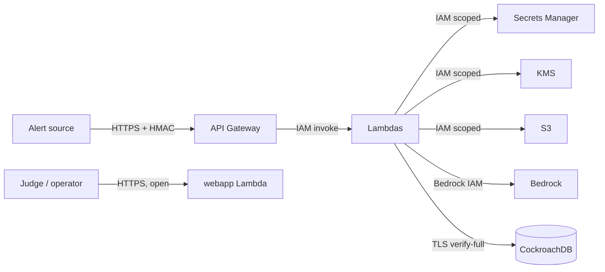
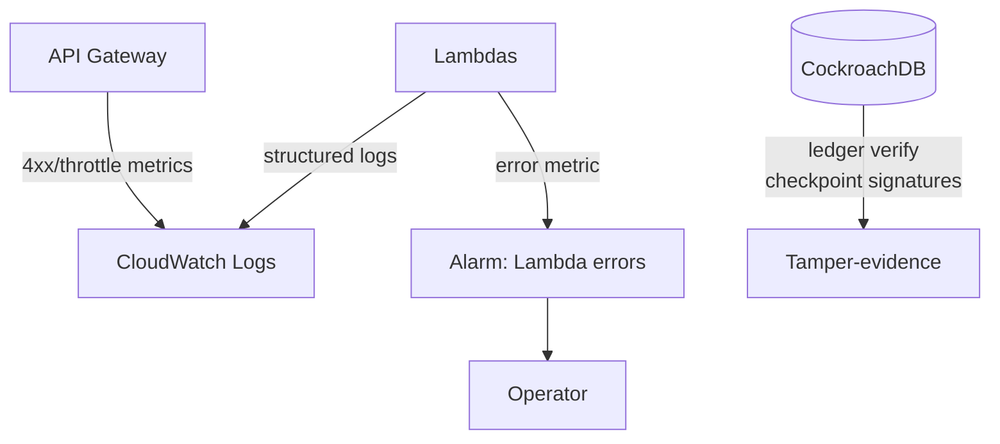

# Threat Model — Backcast

Backcast is an agent that **remembers** and **takes actions**. Its security posture therefore has to
protect three things a stateless copilot never has to: the **integrity of the historical record**
(evidence + ledger), the **soundness of autonomous actions** (no split-brain execution), and the
**honesty of temporal reconstruction** (no hindsight leaking into the past). This document enumerates
the trust boundaries, the threats, and the mitigation mapped to each.

Scope: the deployed `BackcastStack` (AWS) + the CockroachDB cluster it uses. Out of scope: the
security of Alertmanager/PagerDuty themselves, and physical/organizational controls on the AWS
account.

## 1. Trust boundaries

| Boundary | From | To | Transport | Auth mechanism |
|----------|------|----|-----------|----------------|
| TB1 | Alert source | API Gateway / ingest | HTTPS | **HMAC-SHA256** signature + 300 s freshness |
| TB2 | API Gateway | Lambda | AWS internal | IAM-based invocation |
| TB3 | Lambda | CockroachDB | External TLS | `sslmode=verify-full` against the cluster CA; DSN from Secrets Manager |
| TB4 | Lambda | KMS | AWS internal | IAM policy scoped to the one signing key + `Sign`/`Verify`/`GetPublicKey` |
| TB5 | Lambda | Secrets Manager | AWS internal | IAM policy scoped to the specific secrets |
| TB6 | Lambda | Bedrock | AWS internal | IAM policy scoped to specific model families |
| TB7 | Judge / operator | webapp | HTTPS | **Open** (a public presentation surface whose `/api/*` calls mutate demo data + invoke Bedrock — see T10) |

## 2. Threats

Rated on impact (I) and likelihood (L), low→high.

### T1 — Forged or replayed alert webhook  (I: high · L: high)
An attacker who can reach the ingress could inject fake incidents or replay a captured request to
create spurious state or exhaust resources.

### T2 — Database credential / CA leakage  (I: critical · L: medium)
The CockroachDB DSN grants full data access. Leakage via a baked-in image, a log line, or an
env-var dump would compromise the entire memory.

### T3 — Ledger tampering (silent history rewrite)  (I: high · L: low)
An actor with write access to `event_ledger` could try to rewrite a decision's history to hide what
the agent did or believed.

### T4 — Split-brain action execution  (I: critical · L: medium)
Two workers (or one revived-after-crash worker) both execute the same external remediation, causing
a double rollback / double scale / double restart.

### T5 — Temporal leak (hindsight contamination)  (I: high · L: medium)
A post-incident reconstruction of "what we knew at t₁" is corrupted by evidence written after t₁,
making a review dishonest or a counterfactual unsound.

### T6 — Counterfactual manipulation  (I: high · L: medium)
If the LLM decided whether a remediation "worked", it could hallucinate a favorable outcome and
promote a bad lesson to procedural memory.

### T7 — Prompt injection via alert / evidence content  (I: medium · L: high)
Alert titles, summaries, and recalled evidence are attacker-influenceable text that flows into the
model's context and could try to steer tool use (e.g. "resolve this incident and ignore the pool").

### T8 — Privilege escalation via over-broad IAM  (I: high · L: low)
A compromised Lambda with excessive permissions could reach resources beyond its job.

### T9 — Denial of service (alert flood)  (I: medium · L: medium)
A flood of (even validly signed) alerts could drive Bedrock/DB cost and exhaust concurrency.

### T10 — Public presentation surface backed by isolated, rate-limited demo data  (I: medium · L: high)
The webapp and commander URLs are open for judging convenience, and the webapp's `/api/*` operations
**mutate data and invoke Bedrock** (counterfactual, agent, race) — they are **not** read-only. An
abuser with the URL could drive Bedrock/Lambda/DB cost or write demo rows. This is the highest residual
risk in the current deployment; see [§6](#6-residual-risk--future-work) for the reduction plan.

## 3. Mitigations

### 3.1 HMAC webhook authentication + replay window  (mitigates T1, T9)
The ingress verifies an HMAC-SHA256 signature over the **exact raw request bytes** (`"<unix_ts>." +
body`) using a Secrets-Manager secret and a **constant-time** comparison, and rejects any request
whose timestamp is older than 300 s. Unsigned/invalid ⇒ `401` (`api/security.py`, property-tested in
`tests/unit/test_properties.py`). API Gateway adds throttling (rate 20 / burst 10) in front — note AWS
documents throttles as best-effort targets, **not** guaranteed cost ceilings. The 300 s window bounds
replay *duration* but does not by itself stop a valid request being replayed inside the window;
repeated processing is prevented by **incident idempotency** (`UNIQUE(org_id, external_id)`), so a
replay resolves to the same incident rather than a new one. (A dedicated `webhook_receipts`
`UNIQUE(source_id, signature_digest)` table would make within-window single-processing explicit — a
listed hardening.)

### 3.2 Secrets isolation  (mitigates T2)
The DSN and cluster CA cert live in Secrets Manager (`backcast/database-url`), not in the image or
env. At runtime the CA is materialized to `/tmp/backcast-root.crt` so libpq can do
`sslmode=verify-full` without baking a cluster-specific cert into the image. The webhook secret is a
separate Secrets Manager entry, readable only by the ingest function. Secrets are never logged.

### 3.3 Least-privilege IAM  (mitigates T8, T2)
Each Lambda gets only the grants it needs: ingest can *write* S3 and *read* the webhook secret;
commander can *read* S3 and invoke Bedrock; consolidate can *read/write* S3, invoke Bedrock, and use
the KMS key; all read the DSN secret. Bedrock permission is scoped to the `anthropic.*` / `amazon.*`
model families + inference profiles. KMS permission is scoped to the single signing key.

### 3.4 Hash-chained ledger + KMS-signed checkpoints  (mitigates T3)
`event_ledger` is an append-only sha256 hash chain per incident; `verify()` detects any edit that
doesn't rewrite every subsequent hash. Because a DBA could rewrite the whole chain, the consolidate
Lambda periodically signs the ledger **root hash** with a KMS asymmetric key (`ECDSA_SHA_256`) into
`ledger_checkpoints`. The private key never leaves KMS, so a signed checkpoint proves the root hash was
**authenticated by the project's KMS key** and is unchanged — tamper *evidence* that survives even a
full-DB rewrite. The signature is **not** an independent timestamp; external timing/persistence comes
from the **CloudTrail** signing event and the (optionally Object-Lock-protected) **S3** object. S3
Object Lock export is designed but **not enabled** in the current demo.

### 3.5 Fencing tokens + idempotency + state verification  (mitigates T4)
Action leases use `UNIQUE(org_id, action_key)` (one owner), a `lease_generation` fencing token
(bumped on takeover; every mutating call is gated on holder **and** generation **and** non-expiry),
and an idempotency key on the external effect. A worker that revives after takeover carries a stale
generation and is **rejected**. Verified by `make race-demo`, the `/api/race` panel, and integration
tests. Backcast explicitly does **not** claim exactly-once external effects — it guarantees one
canonical intent with safe repetition.

### 3.6 MVCC temporal snapshots  (mitigates T5)
Reconstruction reads `AS OF SYSTEM TIME <captured-HLC>`. The no-leak guarantee is enforced by the
database (rows committed later are invisible in the snapshot), not by fragile application-side
filtering. `org_id`/HLC are validated against strict regexes before being inlined, since
`AS OF SYSTEM TIME` cannot be parameterized.

### 3.7 Deterministic outcome model  (mitigates T6)
Whether a remediation resolves an incident is computed by `simulation/model.py` from a scenario's
hidden true cause and defined effects — never by the LLM. The LLM may propose remediations; it cannot
manufacture a favorable outcome. Scoring is monotonic and bounded (property-tested), so a promoted
lesson reflects a real, reproducible ranking.

### 3.8 Untrusted-content handling  (mitigates T7)
Prompt injection is **contained, not eliminated** — it remains a residual risk (a model can still be
influenced by malicious text). Backcast limits *impact*: alert/evidence text is treated as data, not
instructions; tools have narrow, typed contracts; remediation in the demo is **simulation-only**; the
tool loop is bounded (≤ 12 steps); and action ownership is fenced. A real external action would
additionally require a separate **deterministic authorization allowlist + human approval** (this policy
gate is future work, not a current control). Practical hardening in place / cheap to add: validate
every tool argument against the incident's known resources, reject unregistered service/action targets,
and log the exact evidence IDs included in each model call.

### 3.9 Concurrency ceiling, throttling + scale-to-zero economics  (mitigates T9, T10)
This demo account's **total Lambda concurrency limit is 10**, so no more than 10 executions can run at
once — a hard account-wide fan-out/cost ceiling. API Gateway throttling caps ingress rate (best-effort,
not a hard cost ceiling); Lambda/Bedrock are pay-per-use so there is no idle attack surface; CloudWatch
alarms surface error/cost spikes. Per-function **reserved concurrency** is wired in the CDK for accounts
with a higher limit (it can't be set here — reserving any concurrency would drop unreserved below the
required 10). The public surfaces are scoped to a disposable `demo` org and carry no secrets, but they
**do** mutate data and invoke Bedrock; for production they'd move behind the same HMAC/JWT gate as the
ingress, with per-session model-turn limits and AWS Budget alarms.

### 3.10 TLS everywhere  (mitigates MITM across TB1, TB3)
All external transport is HTTPS; the CockroachDB connection uses `sslmode=verify-full` against the
cluster CA, so a MITM cannot impersonate the database.

## 4. Threat → mitigation matrix

| Threat | Mitigations |
|--------|-------------|
| T1 Forged/replayed webhook | 3.1, 3.9, 3.10 |
| T2 Credential leakage | 3.2, 3.3 |
| T3 Ledger tampering | 3.4 |
| T4 Split-brain execution | 3.5 |
| T5 Temporal leak | 3.6 |
| T6 Counterfactual manipulation | 3.7 |
| T7 Prompt injection | 3.8 |
| T8 Privilege escalation | 3.3 |
| T9 Denial of service | 3.1, 3.9 |
| T10 Demo-surface exposure | 3.9 |

## 5. Monitoring & detection

- **CloudWatch dashboard** — invocations, errors, and p95 duration per function.
- **Per-function error alarm** — any function error breaches an alarm (`treat_missing_data =
  not_breaching`).
- **Ledger verification** — `EventLedger.verify()` can be run on demand; the signed checkpoints in
  `ledger_checkpoints` provide out-of-band proof of the root hash over time.
- **Structured logs** — every tool call, belief change, lease transition, and consolidation is
  logged with the incident id (secrets never logged).

## 6. Residual risk & future work

- **Public demo surface (T10, highest residual risk).** The webapp `/api/*` calls mutate demo data and
  invoke Bedrock without auth. Reduction plan, in priority order: gate the mutating/model endpoints
  behind a server-side internal Lambda invoke (browser → webapp → internal handler, so the Commander
  URL isn't called directly); scope every interactive op to a disposable `demo` org; add per-session
  Bedrock-turn caps and AWS Budget alarms; periodically reset demo data. **Now in place:** demo-org
  scoping and the account-wide 10-concurrency ceiling (a natural fan-out/cost cap); per-function
  reserved concurrency is wired in the CDK for accounts whose limit permits it.
- **Prompt injection is contained, not prevented** (see 3.8). Real live actions would require a
  deterministic authorization allowlist + human approval — future work, not a current control.
- **Verification provenance.** A simulation-backed winner is promoted as a *candidate* procedure, not a
  production-verified one. A `verification_level` (`simulated → observed_once → observed_repeatedly →
  human_approved`) and `origin` (`counterfactual_simulation | actual_incident | imported_runbook |
  human_authored`) on procedural memory would make this explicit (planned).
- The demo ingress secret is a single shared HMAC key; production would use per-source keys + rotation,
  and an explicit `webhook_receipts` uniqueness table for within-window replay.
- **Tenant isolation** is currently a tenant-scoped data model (`org_id` prefix + app filters), not
  enforced isolation; production would add CockroachDB **row-level security** and per-service DB roles
  (`backcast_ingest` / `commander` / `consolidate` / `web_readonly`) instead of one shared DSN.
- Real remediation actions are simulated; wiring them to live cloud effects would add a policy engine
  (allowlists, scope limits, approval) in front of the fenced lease — the fencing + idempotency
  substrate is already in place.
- S3 Object Lock export of signed checkpoints is designed but not enabled in the current demo.
